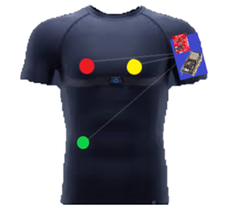
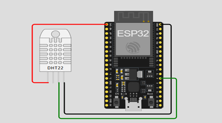

#  Intelligent Glasses Project

[![Contributors][contributors-shield]][contributors-url] 
[![Forks][forks-shield]][forks-url]
[![Issues][issues-shield]][issues-url]
[![Stargazers][stars-shield]][stars-url] 
[![LinkedIn][linkedin-shield]][linkedin-url] 

  

### About the prject

(<a href="#readme-top">back to top</a>)

### Functionality of the project

### Object detection and Face recognition

#### Features:

#### where i have use it ?:

   

  
  

 

(<a href="#readme-top">back to top</a>)

### k

   

  

(<a href="#readme-top">back to top</a>)

   

  

   
### Summary

### Resources

<ul>
  <li><a href="https://www.python.org/" target="_blank">Python</a></li>

  
</ul>

(<a href="#readme-top">back to top</a>)

<!-- MARKDOWN LINKS & IMAGES -->

[contributors-shield]: https://img.shields.io/github/contributors/LAAOUAFIFATIHA/intelligent_glasses?style=for-the-badge
[contributors-url]: https://github.com/LAAOUAFIFATIHA/intelligent_glasses/graphs/contributors

[forks-shield]: https://img.shields.io/github/forks/LAAOUAFIFATIHA/intelligent_glasses?style=for-the-badge
[forks-url]: https://github.com/LAAOUAFIFATIHA/intelligent_glasses/network/members

[issues-shield]: https://img.shields.io/github/issues/LAAOUAFIFATIHA/intelligent_glasses?style=for-the-badge
[issues-url]: https://github.com/LAAOUAFIFATIHA/intelligent_glasses/issues

[stars-shield]: https://img.shields.io/github/stars/LAAOUAFIFATIHA/intelligent_glasses?style=for-the-badge
[stars-url]: https://github.com/LAAOUAFIFATIHA/intelligent_glasses/stargazers

[linkedin-shield]: https://img.shields.io/badge/-LinkedIn-black.svg?style=for-the-badge&logo=linkedin&colorB=555
[linkedin-url]: https://www.linkedin.com/in/fatiha-laaouafi-4227252ba/

[stars-shield]: https://img.shields.io/github/stars/LAAOUAFIFATIHA/PickSchool_Flutter_project?style=for-the-badge
[stars-url]: https://github.com/LAAOUAFIFATIHA/PickSchool_Flutter_project/stargazers
