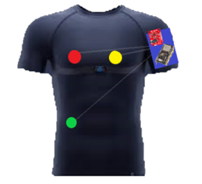

<h1 align="center" id="readme-top">Smart T-Shirt: TinyML Heart Anomaly Detection</h1>

  

  <b>A wearable that records ECG, motion, temperature and humidity, detects heart anomalies in real time on a microcontroller, and confirms them with an online learning model on an external server.</b>

  
  
  
  

<h2>📌 About the Project</h2>

  The <b>Smart T-Shirt</b> is an intelligent wearable built on <b>TinyML</b>, the practice of training a machine
  learning model and running it directly on a low-power embedded device. Sensors embedded in the shirt
  collect physiological and motion data, and a small neural network running on the <b>ESP32</b> predicts
  whether the latest reading contains a <b>heart anomaly</b>. Moving inference from the cloud to the device
  gives a very fast response and saves resources.

  The project targets the medical field: <b>early detection of heart anomalies</b> to support patients.

<h2>🎯 Key Features</h2>
<ul>
  <li><b>Real-time ECG monitoring</b> with the AD8232 sensor.</li>
  <li><b>Motion detection</b> with a gyroscope/accelerometer, to know whether the wearer is moving.</li>
  <li><b>Temperature and humidity</b> sensing with the DHT22.</li>
  <li><b>Local model:</b> a neural network (TensorFlow Lite) running on the ESP32, with an LED alert and an on-device display.</li>
  <li><b>External model:</b> K-Means + KNN with online learning that retrains with every new row of data.</li>
  <li><b>MQTT communication</b> between the device, the server and the dashboard.</li>
  <li><b>Live Grafana dashboard</b> showing raw data and predictions, with a red indicator when an anomaly is detected.</li>
</ul>

<h2>🏗️ System Architecture</h2>

  

<ol>
  <li>The microcontroller reads the sensors: <b>AD8232</b> (ECG), <b>gyroscope</b> (motion) and <b>DHT22</b> (temperature and humidity).</li>
  <li>The <b>ESP32</b> receives <b>raw sensor values only</b>, so its local model can be personalised with each user's own data.</li>
  <li>The data sent to the <b>MQTT broker</b> (Mosquitto) also carries user details such as name and age, so the external model is more general and accurate.</li>
  <li>The <b>external server</b> runs the K-Means + KNN model, stores every row and its predicted class in a database (SQLAlchemy), and publishes the prediction back over MQTT.</li>
  <li><b>Grafana</b> displays the signals and both models' predictions in real time.</li>
</ol>

<h2>🧠 TinyML Workflow</h2>

  

  The neural network is trained with <b>TensorFlow</b>, converted to <b>TFLite</b>, then converted to a
  <b>C array</b> so it can be embedded in the microcontroller firmware.

<h2>🔧 Hardware</h2>
<table>
  <tr>
    <th align="left">Component</th>
    <th align="left">Role</th>
  </tr>
  <tr><td><b>ESP32</b></td><td>Main microcontroller (Wi-Fi/Bluetooth), runs the local TinyML model</td></tr>
  <tr><td><b>STM32</b></td><td>Microcontroller family used in the architecture design for sensor acquisition</td></tr>
  <tr><td><b>AD8232</b></td><td>ECG signal conditioning (extracts, amplifies and filters biopotential signals)</td></tr>
  <tr><td><b>Gyroscope (MPU-6050)</b></td><td>Acceleration and rotation angle, used to detect motion</td></tr>
  <tr><td><b>DHT22</b></td><td>Temperature and humidity</td></tr>
  <tr><td><b>GMG12864-06D display</b></td><td>On-device display of readings and the local prediction</td></tr>
  <tr><td><b>LED</b></td><td>Anomaly indicator</td></tr>
</table>

<h3>Wiring</h3>

  

<table>
  <tr>
    <th align="left">Sensor</th>
    <th align="left">Connections</th>
  </tr>
  <tr><td><b>Gyroscope</b></td><td>GND → GND, VCC → 3.3V, SCL → GPIO22, SDA → GPIO21</td></tr>
  <tr><td><b>DHT22</b></td><td>GND → GND, VCC (+) → 3.3V, OUT → GPIO4</td></tr>
  <tr><td><b>AD8232</b></td><td>GND → GND, 3.3V → 3.3V, OUT → GPIO34</td></tr>
  <tr><td><b>GMG12864-06D</b></td><td>VDD → 3.3V, VSS → GND, CS → GPIO5, RSE → GPIO21, RS → GPIO19, SCL → GPIO18, SI → GPIO23, A → 3.3V, K → GND</td></tr>
</table>

  

<h2>📊 Data Acquisition &amp; Preprocessing</h2>

  Two datasets are generated from the sensors: one to train the <b>local model</b> and one for the
  <b>external model</b>. Noisy or incomplete rows caused by signal loss or interference are removed, and values
  are converted to compact data types to save memory.

  

<table>
  <tr><th align="left">ECG feature</th><th align="left">Normal range</th></tr>
  <tr><td>Heart rate</td><td>60–100 BPM</td></tr>
  <tr><td>RR interval</td><td>600–1000 ms</td></tr>
  <tr><td>PP interval</td><td>Similar to the RR interval</td></tr>
  <tr><td>QT interval</td><td>350–450 ms</td></tr>
</table>

<b>Preprocessing steps:</b>

<ul>
  <li>Remove empty and redundant rows or columns.</li>
  <li>Fill missing values with the column mean.</li>
  <li>Select the relevant features (temperature, humidity, motion, ECG intervals).</li>
  <li>Standardise values: <code>(value − mean) / scale</code>.</li>
</ul>

  

<h2>🤖 Model 1: Neural Network on the ESP32</h2>

  

<ul>
  <li><b>Architecture:</b> 10 inputs, 3 layers, ReLU in the first layer, sigmoid output (binary classification: normal / anomaly).</li>
  <li><b>Training:</b> TensorFlow, with several training runs to tune the parameters.</li>
  <li><b>Conversion:</b> TensorFlow → <code>.tflite</code> → C array.</li>
  <li><b>Deployment:</b> <code>ECG_model.h</code> holds the C array and <code>ECG_model.cpp</code> declares and initialises the TFLite model.</li>
  <li><b>Result:</b> real-time prediction on the ESP32, and the LED lights up when an anomaly is detected.</li>
</ul>

  

<h2>🌐 Model 2: K-Means + KNN on the External Server</h2>
<ol>
  <li>A new row arrives through MQTT and is preprocessed.</li>
  <li><b>K-Means</b> finds the cluster closest to the new row.</li>
  <li><b>KNN</b> is run on that cluster to predict the class of the row.</li>
  <li>A <b>reference distance threshold</b> (the average distance between all rows) separates meaningful proximity from irrelevant matches.</li>
  <li>The row and its predicted class are stored in the database, so the model <b>keeps learning online</b>.</li>
</ol>

  Because of online learning, its response is slower than the on-device model, but it benefits from a larger and
  more varied dataset.

  
  

<h2>📈 Visualization with Grafana</h2>

  Grafana shows the ECG signal (with estimated RR and PP intervals and noisy segments marked), the motion state
  (1 = moving, 0 = still), temperature and humidity, and the predictions of both models.
  A red indicator appears when an anomaly is detected.

  

  

  

<h3>On-device display</h3>

  The local model's prediction is also shown on the physical display. Since it is connected directly to the
  ESP32, the response is very fast.

  

<h2>🛠️ Built With</h2>
<ul>
  <li><a href="https://www.python.org/" target="_blank">Python</a> (training, external server, SQLAlchemy)</li>
  <li>C++ / Arduino IDE (ESP32 firmware)</li>
  <li>TensorFlow &amp; TensorFlow Lite</li>
  <li>Google Colab</li>
  <li>MQTT (Mosquitto)</li>
  <li><a href="https://grafana.com/" target="_blank">Grafana</a></li>
  <li>VS Code, Git &amp; GitHub</li>
</ul>

<h2>📝 Summary</h2>

  The Smart T-Shirt is a fully functional prototype that combines embedded sensing, edge AI, an online learning
  server and a live dashboard. It responds to real data with good performance, and it lays the foundation for
  wearables that detect heart anomalies early and can help save lives. Future work can extend it with more
  sensors and tasks while keeping performance high.

<h2>📚 Resources</h2>
<ul>
  <li><a href="https://www.allaboutcircuits.com/technical-articles/what-is-tinyml/" target="_blank">What is TinyML?</a></li>
  <li><a href="https://docs.python.org/3/" target="_blank">Python documentation</a></li>
  <li><a href="https://randomnerdtutorials.com/esp32-mpu-6050-web-server/" target="_blank">ESP32 + MPU-6050 tutorial</a></li>
  <li><a href="https://github.com/alcarazolabs/EloquentTinyML-ESP32-Example" target="_blank">EloquentTinyML ESP32 example</a></li>
  <li><a href="https://pubmed.ncbi.nlm.nih.gov/21272132/" target="_blank">Heart dangers study (PubMed)</a></li>
</ul>

(<a href="#readme-top">back to top</a>)

